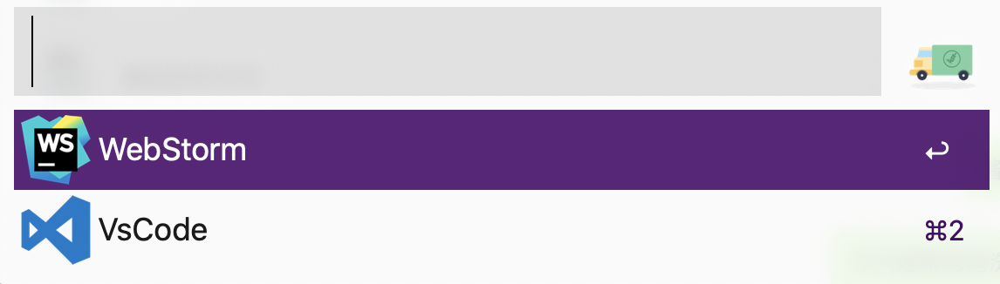
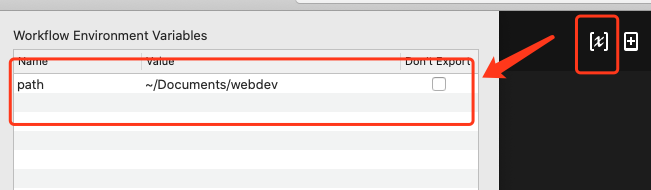

# 快捷打开项目的WorkFlow

### [下载地址](https://github.com/AsiamCn/open-project-workflow/releases)

### 功能
1. 输入code + 文件名，可以过滤出包含文件名的项目目录。
2. 选择项目之后，会再让用户选择使用vscode还是webStorm打开。

两个步骤的示意图如下：

### 配置
需要在下图这里配置项目路径：

### [实现原理](https://zeyio.com/alfred-tool/)
